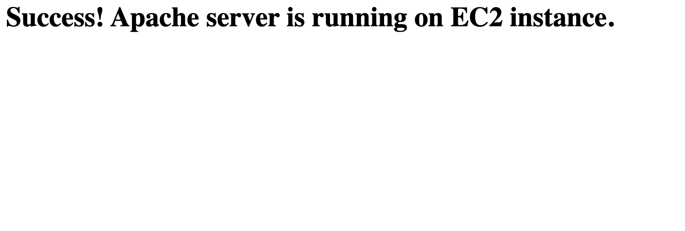
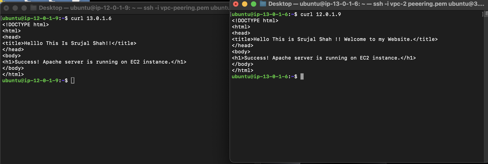

# AWS VPC Peering DEMO

## Table of Contents

- [Introduction](#introduction)
- [Prerequisites](#prerequisites)
- [Getting Started](#getting-started)
- [Setting Up VPC Peering](#setting-up-vpc-peering)
- [Testing Connectivity](#testing-connectivity)
- [Contributing](#contributing)

---

## Introduction

This repository contains a demonstration of setting up VPC peering between two Amazon Virtual Private Clouds (VPCs) using AWS services.

## Prerequisites

- An AWS account with appropriate permissions to create and manage VPCs and VPC peering connections.
- Basic knowledge of Amazon Web Services (AWS) and Virtual Private Clouds (VPCs).

## Getting Started

To get started with this demonstration, follow these steps:

1. Clone this repository to your local machine.
2. Navigate to the repository directory.

   

## Setting Up VPC Peering

Follow these steps to set up VPC peering between two VPCs:

1. **Create VPCs**: 
   - Create two separate VPCs in your AWS account.

     

2. **Create VPC Peering Connection**:
   - Navigate to the VPC Dashboard in the AWS Management Console.
   - Select "Peering Connections" from the left-hand menu.
   - Click "Create Peering Connection" and follow the on-screen instructions.

3. **Accept Peering Connection**:
   - Switch to the AWS account that owns the accepter VPC.
   - Navigate to the VPC Dashboard > Peering Connections.
   - Select the peering connection created by the requester VPC and accept it.

4. **Update Route Tables**:
   - Update the route tables in both VPCs to include routes for the CIDR blocks of the peered VPCs.

## Testing Connectivity

Once the VPC peering connection is established and route tables are updated, test connectivity between instances in the peered VPCs.

## Contributing

Contributions are welcome! If you have any ideas, enhancements, or bug fixes, feel free to open an issue or submit a pull request.
